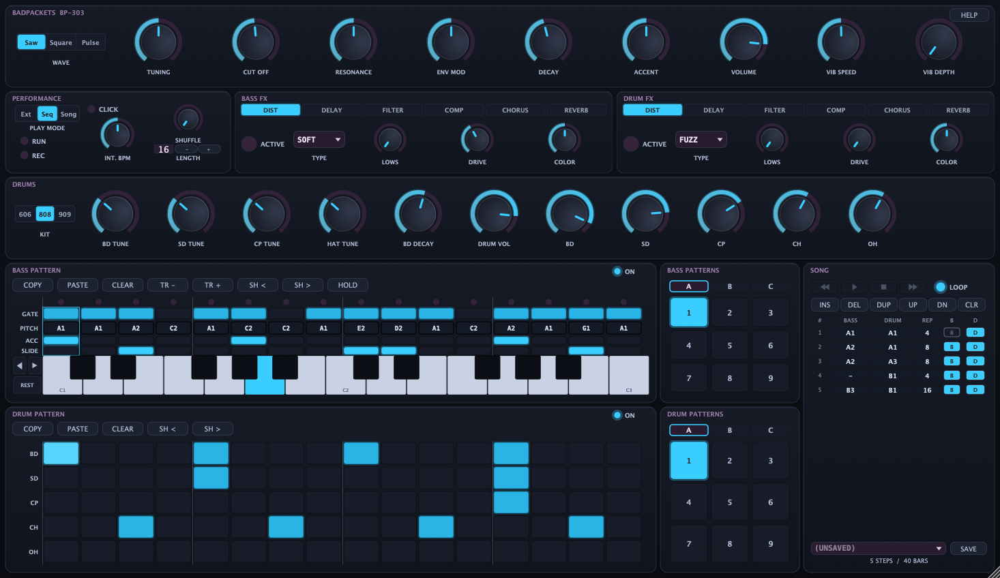
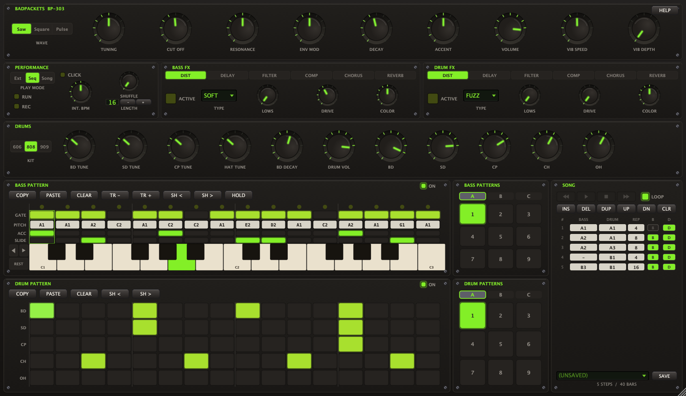

# BP303

A TB-303 style bass synthesiser and drum machine in one instrument, built with
[JUCE](https://juce.com). Monophonic acid bass line with the classic accent and
slide behaviour, a five-voice drum machine, a step sequencer for each, and a song
arranger to chain patterns together.

Runs as a standalone app on **macOS and Windows**, and as an **Audio Unit** on
macOS. The AU is what it was developed and tested against, in Logic Pro.



## Download

Grab the latest build from [Releases](../../releases).

### macOS

Two downloads, the Audio Unit and the standalone app. Both are universal (Apple
Silicon and Intel) and run on macOS 11 or later. From v0.2.0 on they are signed
with a Developer ID and notarized by Apple, so they open like any other download —
no right-click, and nothing to run in Terminal.

- **Audio Unit** — unzip it and move `BP303.component` into
  `~/Library/Audio/Plug-Ins/Components/`, then open Logic Pro. BP303 is under
  *AU Instruments → JC Audio*.
- **Standalone** — unzip it and move `BP303.app` into *Applications*.

If Logic rejected an earlier, unsigned BP303, it remembers: open *Plug-in Manager*,
select BP303 and choose *Reset & Rescan Selection*.

v0.1.0 predates this — it was standalone-only and unsigned, and needed macOS 26.

### Windows

The standalone is not code-signed, so SmartScreen will warn once. Choose
*More info*, then *Run anyway*.

The audio runs on WASAPI, since the ASIO SDK can't be redistributed. That's fine
for the sequencer, but if you're playing it live from a MIDI keyboard, open the
audio settings and switch to exclusive mode with a small buffer.

## What's in it

**Bass voice** — PolyBLEP saw / square / pulse oscillator into a zero-delay-feedback
4-pole ladder filter, with the 303's cutoff, resonance, env mod, decay and accent
controls. Accent, slide and the fixed snappy accent decay all behave the way the
original does. Vibrato on top, retriggered per note.

**Drum machine** — five voices (kick, snare, clap/rim, closed hat, open hat) in
three synthesised kits: 606, 808 and 909. Per-voice level and tuning, plus kick decay.

**Sequencers** — 16 steps each for bass and drums, three-way step dynamics
(soft / normal / accent), slide and hold per bass step, shuffle, and 27 pattern
slots per line. Live step-record and a HOLD mode for playing patterns in from a
keyboard. Both lines share one transport phase, so a line toggled on mid-pattern
lands on the shared grid.

**Song mode** — an arrangement that names a bass pattern and a drum pattern per
row, with per-line mutes. Song position is derived from the host transport rather
than counted, so looping, jumping and starting mid-project all land correctly.

**Per-line FX** — bass and drums each get their own chain: envelope-followed
filter, distortion (soft / fuzz / fold / rectify / crush), tempo-synced delay,
compressor, chorus and reverb.

**Also** — five UI skins with a hue control, a metronome, MIDI drag-out of the
current pattern, and live drum triggering from GM notes on MIDI channel 10.



*Bad Packets, one of the five skins. Neon Slate, above, is what a fresh install
opens on.*

## Building

Requires CMake 3.22+ and a C++17 compiler — Xcode on macOS 11.0 or later, MSVC on
Windows. JUCE 8.0.8 is fetched automatically by CMake, so you don't need to
install it.

```bash
cmake -S . -B build -DCMAKE_BUILD_TYPE=Release
```

```bash
cmake --build build --config Release --target BP303_Standalone
```

`BP303_AU` builds the Audio Unit instead, and copies it to
`~/Library/Audio/Plug-Ins/Components/` after the build. AU is macOS-only; on
Windows that target simply isn't generated.

Mac builds are universal (arm64 + x86_64) by default, which roughly doubles the
build time. Pass `-DCMAKE_OSX_ARCHITECTURES=arm64` while developing.

The first configure clones JUCE, so it takes a few minutes and the `build/`
directory ends up around 1 GB.

[CI](.github/workflows/build.yml) builds and tests both platforms on every push
and pull request, and pushing a `v*` tag attaches its standalone zips to a
Release. Those CI builds are unsigned; the signed and notarized macOS downloads
are built, signed and uploaded separately.

## Tests

The DSP and sequencer code is deliberately JUCE-free where it can be, so most of
it is testable headlessly. Each `Tools/*_test.cpp` is a self-contained program;
they're also wired up as CMake targets. CI runs the JUCE-free subset on both
platforms; the editor and plugin-hosting tests are run locally on macOS.

```bash
cmake --build build -j8
```

```bash
for t in build/BP303_*Test_artefacts/Release/BP303_*Test; do "$t" >/dev/null || echo "FAIL $t"; done
```

Some tools write PNG or WAV output into the working directory for eyeballing —
`BP303_Snapshot` renders the editor, `BP303_PerfBench` measures repaint cost.
Those outputs are gitignored.

## Licence

BP303 is released under the **GNU Affero General Public License v3.0**. See
[LICENSE](LICENSE).

This is not an arbitrary choice: BP303 links the JUCE framework, whose modules are
dual-licensed under the AGPLv3 and a commercial licence. Building on the
open-source option means this project inherits the AGPLv3. If you want to ship a
closed-source derivative you will need a commercial JUCE licence from
[juce.com](https://juce.com/get-juce/) — and my permission for this code.

JUCE itself is not included in this repository; CMake fetches it at configure time
under its own licence.

TB-303, TR-606, TR-808 and TR-909 are trademarks of Roland Corporation, which has
no association with this project. The kit names describe what the voices are
modelled on.
